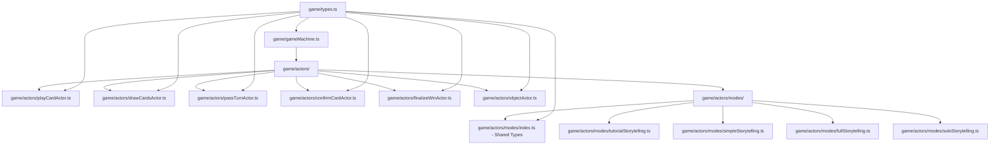

# Design Document: Game Machine Type Safety

## Overview

This design addresses type safety improvements for the XState game machine by introducing proper TypeScript interfaces for all actor inputs. The solution replaces inline typing patterns with centralized, reusable type definitions that integrate seamlessly with existing `GameEvent` and `GameContext` types.

The design focuses on creating a type-safe actor system that prevents runtime errors, improves developer experience, and maintains backward compatibility while following the existing code organization patterns.

## Architecture

### Current State Analysis

The current game machine suffers from several type safety issues:

1. **Inline Actor Typing**: Actors use generic `{ input: { ... } }` patterns
2. **Type Errors**: Multiple TypeScript compilation errors due to missing properties
3. **No Centralized Types**: Actor input types are scattered and inconsistent
4. **Runtime Risk**: Type mismatches can cause runtime failures

### Proposed Architecture

The new architecture follows XState v5's actor-first modular design:

1. **Modular Actor Structure**: Actors organized in separate files by functionality
2. **Centralized Type Definitions**: Shared types and interfaces in dedicated files
3. **Type-Safe Actor Definitions**: Each actor uses proper TypeScript interfaces
4. **Compile-Time Validation**: All type errors caught during compilation



## Components and Interfaces

### File Structure Organization

Following XState v5's actor-first modular design:

```
game/
├── gameMachine.ts              # Main game machine
├── types.ts                    # Shared types and interfaces
└── actors/
    ├── playCardActor.ts        # Play card database operations
    ├── drawCardsActor.ts       # Draw cards database operations
    ├── passTurnActor.ts        # Pass turn database operations
    ├── confirmCardActor.ts     # Confirm card database operations
    ├── finalizeWinActor.ts     # Finalize win database operations
    ├── objectActor.ts          # Object action database operations
    └── modes/
        ├── index.ts            # Shared storytelling types (StorytellingEvent, etc.)
        ├── tutorialStorytelling.ts
        ├── simpleStorytelling.ts
        ├── fullStorytelling.ts
        └── soloStorytelling.ts
```

### Shared Type Definitions

All actor input types will be defined in `game/types.ts`:

```typescript
// game/types.ts
export interface PlayCardActorInput {
  gameSessionId: string
  playerId: string
  cardId: string
  position: number
}

export interface DrawCardsActorInput {
  gameSessionId: string
  playerId: string
  count: number
}

export interface PassTurnActorInput {
  gameSessionId: string
  nextPlayerId: string
}

export interface ConfirmCardActorInput {
  playedCardId: string
}

export interface FinalizeWinActorInput {
  gameSessionId: string
  winnerId: string
  lobbyId: string
}

export interface ObjectActorInput {
  gameSessionId: string
  playedCardId: string
  storytellerId: string
  nextPlayerId: string
}
```

### Individual Actor Files

Each actor will be in its own file with proper typing:

```typescript
// game/actors/playCardActor.ts
import { fromPromise } from 'xstate'
import { createClient } from '@/utils/supabase/client'
import type { PlayCardActorInput } from '../types'

const supabase = createClient()

export const playCardActor = fromPromise(async ({ input }: { input: PlayCardActorInput }) => {
  const { data, error } = await supabase
    .from('played_cards')
    .insert({
      game_session_id: input.gameSessionId,
      player_id: input.playerId,
      card_id: input.cardId,
      position: input.position,
      status: 'PENDING',
    })
    .select('*, cards(*)')
    .single()

  if (error) throw error

  await supabase
    .from('player_hands')
    .delete()
    .eq('game_session_id', input.gameSessionId)
    .eq('player_id', input.playerId)
    .eq('card_id', input.cardId)

  return data
})
```

### Storytelling Mode Organization

Shared storytelling types in `game/actors/modes/index.ts`:

```typescript
// game/actors/modes/index.ts
export interface StorytellingEvent {
  type: 'PLAY_CARD' | 'PASS' | 'INTERRUPT' | 'OBJECT'
  // ... other shared properties
}

export interface StorytellingContext {
  // ... shared context properties
}
```

Individual storytelling machines in separate files:

```typescript
// game/actors/modes/tutorialStorytelling.ts
import { setup } from 'xstate'
import type { StorytellingEvent, StorytellingContext } from './index'

export const tutorialStorytellingMachine = setup({
  types: {
    context: {} as StorytellingContext,
    events: {} as StorytellingEvent,
  },
}).createMachine({
  // ... machine definition
})
```

## Data Models

### Input Validation Patterns

Each actor input interface will include validation requirements:

```typescript
export interface PlayCardActorInput {
  /** The game session ID - must be a valid UUID */
  gameSessionId: string
  /** The player ID - must be a valid UUID */
  playerId: string
  /** The card ID - must be a valid UUID */
  cardId: string
  /** The position in the played cards sequence - must be >= 0 */
  position: number
}
```

### Type Relationships

The actor input types will maintain clear relationships with existing types:

- `gameSessionId` fields reference the same type as `GameContext.gameSessionId`
- `playerId` fields reference the same type as `Player.id`
- `cardId` fields reference the same type as `CardData.id`

### Database Schema Alignment

All actor input types will align with the Supabase database schema:

```typescript
// Aligns with 'played_cards' table schema
export interface PlayCardActorInput {
  gameSessionId: string  // maps to game_session_id
  playerId: string       // maps to player_id
  cardId: string         // maps to card_id
  position: number       // maps to position
}
```

## Correctness Properties

*A property is a characteristic or behavior that should hold true across all valid executions of a system-essentially, a formal statement about what the system should do. Properties serve as the bridge between human-readable specifications and machine-verifiable correctness guarantees.*

### Property 1: Actor Interface Completeness
*For any* actor defined in the game machine, there should exist a corresponding TypeScript interface that defines its input type
**Validates: Requirements 1.1, 1.4**

### Property 2: Type-Safe Actor Invocations
*For any* actor invocation in the game machine, the input parameter should use the proper TypeScript interface type instead of inline typing
**Validates: Requirements 1.2, 2.1, 2.5**

### Property 3: Database Schema Compatibility
*For any* actor input interface that maps to database operations, all interface properties should be compatible with the corresponding database schema types and required fields should not be optional
**Validates: Requirements 3.2, 3.3, 3.4**

### Property 4: Compilation Success
*For any* valid game machine configuration, the TypeScript compiler should successfully compile without type errors
**Validates: Requirements 2.2, 6.5, 7.4**

### Property 5: Actor Behavior Preservation
*For any* actor that is refactored to use typed interfaces, the actor's runtime behavior should remain identical to its previous implementation
**Validates: Requirements 2.4**

### Property 6: Input Validation Consistency
*For any* actor input, all required parameters should be validated and invalid inputs should produce descriptive error messages
**Validates: Requirements 4.1, 4.2, 4.3**

### Property 7: Type System Integration
*For any* actor input type, it should be compatible with related GameContext and GameEvent types, ensuring seamless integration across the type system
**Validates: Requirements 6.1, 6.2, 6.4**

### Property 8: Interface Documentation Completeness
*For any* actor input interface property, it should have JSDoc documentation that describes its purpose and constraints
**Validates: Requirements 5.3**

### Property 9: Modular Actor Organization
*For any* actor in the system, it should be organized in the appropriate directory structure with database actors in `game/actors/` and storytelling mode actors in `game/actors/modes/`
**Validates: Requirements 1.3, 5.1**

## Error Handling

### Type Error Prevention

The design implements multiple layers of type error prevention:

1. **Compile-Time Validation**: TypeScript interfaces catch type mismatches during compilation
2. **Runtime Validation**: Actors validate input parameters and throw descriptive errors
3. **IDE Integration**: Proper typing enables autocompletion and hover documentation

### Error Recovery Strategies

When type errors occur:

1. **Clear Error Messages**: TypeScript provides specific error locations and expected types
2. **Graceful Degradation**: Actors handle invalid inputs by throwing descriptive errors
3. **Development Feedback**: IDE integration provides immediate feedback during development

### Validation Patterns

Each actor implements consistent validation:

```typescript
async function validatePlayCardInput(input: PlayCardActorInput): Promise<void> {
  if (!input.gameSessionId) throw new Error('gameSessionId is required')
  if (!input.playerId) throw new Error('playerId is required')
  if (!input.cardId) throw new Error('cardId is required')
  if (input.position < 0) throw new Error('position must be >= 0')
}
```

## Testing Strategy

### Dual Testing Approach

The implementation uses both unit tests and property-based tests for comprehensive coverage:

**Unit Tests**: Focus on specific examples, edge cases, and error conditions
- Test specific actor invocations with known inputs
- Verify error handling for invalid inputs
- Test integration points between actors and game machine

**Property Tests**: Verify universal properties across all inputs
- Test that all actors have corresponding interfaces
- Verify type safety across all possible inputs
- Ensure compilation success with various configurations

### Property-Based Testing Configuration

- **Library**: Use `fast-check` for TypeScript property-based testing
- **Iterations**: Minimum 100 iterations per property test
- **Tagging**: Each test references its design document property
- **Tag Format**: `Feature: game-machine-type-safety, Property {number}: {property_text}`

### Testing Focus Areas

1. **Type Safety**: Verify all actors use proper interfaces
2. **Compilation**: Ensure code compiles without type errors
3. **Runtime Behavior**: Verify actors maintain existing functionality
4. **Input Validation**: Test error handling for invalid inputs
5. **Integration**: Test compatibility between type systems

### Example Property Test

```typescript
// Feature: game-machine-type-safety, Property 1: Actor Interface Completeness
test('all actors have corresponding input interfaces', () => {
  fc.assert(fc.property(
    fc.constantFrom(...actorNames),
    (actorName) => {
      const interfaceName = `${actorName}Input`
      expect(typeDefinitions).toHaveProperty(interfaceName)
    }
  ))
})
```