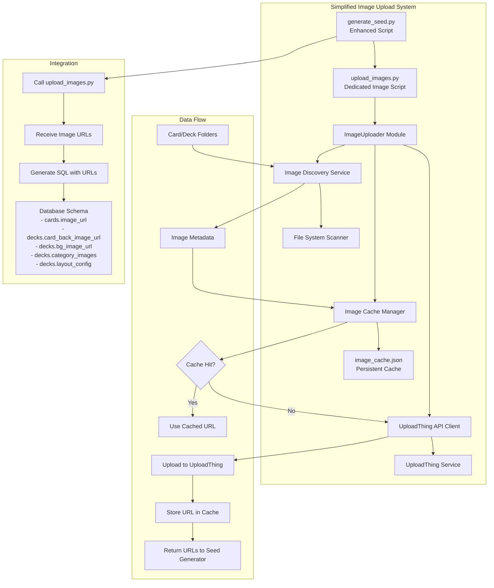

# Design Document

## Overview

The Image Upload Automation system extends the existing seed generation workflow by adding a dedicated image upload script that handles all image-related operations. The existing `generate_seed.py` script will invoke this new image upload script to process images before generating SQL with the resulting URLs.

The design follows a simple architecture where image processing is completely separated from SQL generation, allowing for independent testing and maintenance while keeping the integration straightforward.

## Architecture



## Components and Interfaces

### 1. upload_images.py (Main Script)

**Purpose**: Dedicated script that handles all image upload operations and can be called by the seed generator or run independently.

**Command Line Interface**:
```bash
# Called by seed generator
python upload_images.py --deck default --output-json urls.json

# Standalone usage with filtering
python upload_images.py --deck default --category protagonists
python upload_images.py --card "The Clever Thief" --dry-run
python upload_images.py --validate-cache
python upload_images.py --clear-cache
```

**Output Format**:
```json
{
  "deck_images": {
    "card_back_image_url": "https://uploadthing.com/f/border.jpg",
    "bg_image_url": "https://uploadthing.com/f/gameboard.jpg",
    "category_images": {
      "protagonist": "https://uploadthing.com/f/protagonists.jpg"
    },
    "layout_config": {
      "card_positions": {...}
    }
  },
  "card_images": {
    "The Clever Thief": "https://uploadthing.com/f/clever-thief.jpg",
    "The Wise Mentor": "https://uploadthing.com/f/wise-mentor.jpg"
  }
}
```

### 2. Enhanced generate_seed.py Integration

**Purpose**: Modified seed generator that calls the image upload script and incorporates URLs into SQL generation.

**Integration Points**:
```python
def main():
    # Existing card data processing...
    
    # New: Upload images and get URLs
    image_urls = upload_deck_images(deck_name="default")
    
    # Enhanced: Generate SQL with image URLs
    sql_output = generate_sql_with_images(cards_data, image_urls)
    
    # Existing: Write SQL file
    write_sql_file(sql_output)

def upload_deck_images(deck_name: str) -> dict:
    """Call upload_images.py and return URL mappings"""
    import subprocess
    import json
    
    result = subprocess.run([
        "python", "upload_images.py", 
        "--deck", deck_name,
        "--output-json", "temp_urls.json"
    ], capture_output=True, text=True)
    
    if result.returncode == 0:
        with open("temp_urls.json") as f:
            return json.load(f)
    else:
        print(f"Image upload failed: {result.stderr}")
        return {"deck_images": {}, "card_images": {}}
```

### 3. ImageUploader Module

**Purpose**: Core module used by upload_images.py for handling upload operations with caching and error handling.

**Interface**:
```python
class ImageUploader:
    def __init__(self, api_key: str, app_id: str, cache_file: str = "image_cache.json")
    def upload_image(self, file_path: str, metadata: dict = None) -> str
    def upload_batch(self, file_paths: List[str], max_concurrent: int = 5) -> Dict[str, str]
    def validate_cache(self) -> None
    def clear_cache(self) -> None
```

**Key Features**:
- Concurrent upload support with configurable limits
- Automatic retry with exponential backoff
- Image compression for files > 2MB
- MD5-based cache validation
- Progress reporting with ETA

### 4. ImageCacheManager

**Purpose**: Manages persistent caching of uploaded image URLs to avoid duplicate uploads.

**Interface**:
```python
class ImageCacheManager:
    def __init__(self, cache_file: str)
    def get_cached_url(self, file_path: str, file_hash: str) -> Optional[str]
    def cache_url(self, file_path: str, file_hash: str, url: str) -> None
    def validate_url(self, url: str) -> bool
    def remove_invalid_urls(self) -> int
    def clear_cache(self) -> None
```

**Cache Structure**:
```json
{
  "version": "1.0",
  "entries": {
    "file_path_hash": {
      "file_path": "specs/decks/default/cards/protagonists/The Clever Thief/image.jpg",
      "file_hash": "md5_hash_here",
      "url": "https://uploadthing.com/f/abc123",
      "uploaded_at": "2024-01-15T10:30:00Z",
      "file_size": 245760
    }
  }
}
```

### 5. ImageDiscoveryService

**Purpose**: Scans file system to discover images and organize them by type and location.

**Interface**:
```python
class ImageDiscoveryService:
    def __init__(self, base_path: str = "specs/decks")
    def discover_deck_images(self, deck_name: str) -> DeckImages
    def discover_card_images(self, deck_name: str, category: str = None) -> List[CardImage]
    def discover_all_images(self, filters: ImageFilters = None) -> ImageCollection
```

**Data Models**:
```python
@dataclass
class CardImage:
    card_name: str
    category: str
    file_path: str
    locale: Optional[str] = None  # for locale-specific images

@dataclass
class DeckImages:
    border_image: Optional[str] = None
    background_image: Optional[str] = None
    category_images: Dict[str, str] = field(default_factory=dict)
    layout_config: Optional[str] = None  # path to position.json

@dataclass
class ImageFilters:
    deck_name: Optional[str] = None
    category: Optional[str] = None
    card_name: Optional[str] = None
```

### 6. UploadThingClient

**Purpose**: Handles direct communication with UploadThing API with proper authentication and error handling.

**Interface**:
```python
class UploadThingClient:
    def __init__(self, api_key: str, app_id: str)
    def upload_file(self, file_path: str, metadata: dict = None) -> UploadResult
    def validate_credentials(self) -> bool
    def get_upload_limits(self) -> UploadLimits
```

**Configuration**:
- Maximum file size: 4MB (matching web app limits)
- Supported formats: JPG, JPEG, PNG, WebP
- Rate limiting: 100 requests per minute
- Retry policy: 3 attempts with exponential backoff

## Data Models

### Database Schema Integration

The existing database schema already includes the necessary fields for image URL storage:

```sql
-- Existing schema (no modifications needed)
-- decks table already has:
--   - card_back_image_url TEXT
--   - bg_image_url TEXT  
--   - category_images JSONB
--   - layout_config JSONB

-- cards table already has:
--   - image_url TEXT

-- Example category_images structure:
-- {
--   "protagonist": "https://uploadthing.com/f/protagonists.jpg",
--   "antagonist": "https://uploadthing.com/f/antagonists.jpg",
--   "setting": "https://uploadthing.com/f/settings.jpg"
-- }

-- Example layout_config structure:
-- {
--   "card_positions": {
--     "protagonist": {"x": 100, "y": 150, "rotation": 0},
--     "antagonist": {"x": 300, "y": 150, "rotation": 0}
--   },
--   "board_settings": {
--     "background_opacity": 0.8,
--     "border_width": 5
--   }
-- }
```

### Enhanced SQL Generation

The existing `generate_card_inserts` function will be enhanced to include image URLs:

```python
def generate_card_inserts(cards, card_type, category, label=None, image_urls=None):
    """Enhanced to include image_url in INSERT statements"""
    # image_urls: Dict[card_name, url] from upload_images.py output
    for card_data in cards:
        name = card_data[0]  # card name
        image_url = image_urls.get(name) if image_urls else None
        
        # Include image_url in SQL INSERT
        card_sql = f"""('{card_id}', '{deck_id}', '{escape_sql(name)}', 
                      '{escape_sql(description)}', '{card_type}', {cat_value}, 
                      '{escape_sql(usage_examples)}', '{translations_json}', 
                      {f"'{image_url}'" if image_url else 'NULL'})"""

def generate_deck_insert(deck_data, deck_images: dict):
    """New function to generate deck INSERT with image URLs from upload_images.py"""
    card_back_url = deck_images.get('card_back_image_url')
    bg_url = deck_images.get('bg_image_url') 
    category_images = deck_images.get('category_images', {})
    layout_config = deck_images.get('layout_config', {})
    
    # Generate deck INSERT with image fields populated
    pass
```

## Correctness Properties

*A property is a characteristic or behavior that should hold true across all valid executions of a system-essentially, a formal statement about what the system should do. Properties serve as the bridge between human-readable specifications and machine-verifiable correctness guarantees.*

Based on the requirements analysis, here are the key correctness properties:

**Property 1: Image File Detection**
*For any* directory structure with mixed file types, the image discovery service should only detect files with extensions .jpg, .jpeg, .png, .webp and ignore all other file types
**Validates: Requirements 1.1**

**Property 2: Upload Success URL Storage**
*For any* successful image upload, the system should store the returned URL and associate it with the correct database entity (card or deck)
**Validates: Requirements 1.3, 4.3**

**Property 3: Error Resilience**
*For any* image processing failure (upload, validation, or file access), the system should log the error and continue processing remaining images without terminating
**Validates: Requirements 1.4, 6.1, 6.2, 6.3**

**Property 4: File Size and Type Validation**
*For any* upload attempt, files exceeding 4MB or with unsupported formats should be rejected before attempting upload to UploadThing
**Validates: Requirements 2.2**

**Property 5: Filename Preservation**
*For any* uploaded image, the original filename should be preserved in the UploadThing metadata for traceability
**Validates: Requirements 2.5**

**Property 6: Deck Image Association**
*For any* deck folder containing Border.jpg, GameBoard.jpg, or category images, each image should be uploaded and stored in the appropriate deck database field
**Validates: Requirements 3.1, 3.2, 3.3**

**Property 7: JSON Configuration Parsing**
*For any* valid position.json file in a deck folder, the system should parse it successfully and store the layout data in the deck's layout_config field
**Validates: Requirements 3.4**

**Property 8: Card Image Association**
*For any* card folder containing image files, the first valid image should be uploaded and associated with that specific card's image_url field
**Validates: Requirements 4.1, 4.2**

**Property 9: UUID Determinism**
*For any* card with the same name and deck, the generated UUID should be identical across multiple runs of the system
**Validates: Requirements 4.5**

**Property 10: Cache Round-Trip Consistency**
*For any* image file that hasn't changed (same path, size, and MD5 hash), the system should use the cached URL instead of re-uploading, and the cached URL should be valid
**Validates: Requirements 9.2**

**Property 11: Cache Invalidation**
*For any* cached URL that returns a 404 response, the system should remove it from cache and re-upload the image
**Validates: Requirements 9.4**

**Property 12: Batch Processing Filtering**
*For any* filter criteria (deck name, category, card name), the upload_images.py script should process only images matching those criteria
**Validates: Requirements 10.2, 10.3**

**Property 13: Seed Generator Integration**
*For any* deck processed by generate_seed.py, the script should successfully call upload_images.py and incorporate the returned URLs into the generated SQL
**Validates: Requirements 10.5**

<function_calls>
<invoke name="prework">
<parameter name="featureName">image-upload-automation

## Error Handling

The system implements comprehensive error handling at multiple levels:

### Upload Failures
- **Network Issues**: Automatic retry with exponential backoff (1s, 2s, 4s, 8s)
- **API Rate Limits**: Respect rate limiting with appropriate delays
- **File Corruption**: Skip corrupted files with detailed logging
- **Authentication Errors**: Fail fast with clear error messages

### File System Issues
- **Missing Directories**: Create necessary directories automatically
- **Permission Errors**: Log detailed error information and continue
- **Disk Space**: Check available space before operations
- **File Locks**: Implement retry logic for locked files

### Cache Management
- **Corrupted Cache**: Rebuild cache file automatically
- **Invalid URLs**: Remove from cache and re-upload
- **Concurrent Access**: Use file locking for cache operations

### Configuration Errors
- **Missing Environment Variables**: Provide setup instructions
- **Invalid API Credentials**: Validate before processing
- **Malformed JSON**: Skip invalid configuration files with warnings

## Testing Strategy

The testing approach combines unit tests for specific functionality with property-based tests for universal correctness guarantees.

### Unit Testing Focus
- **API Integration**: Mock UploadThing responses for various scenarios
- **File System Operations**: Test with temporary directories and files
- **Cache Management**: Verify cache file operations and corruption recovery
- **Configuration Parsing**: Test JSON parsing with valid and invalid inputs
- **Error Scenarios**: Simulate network failures, permission issues, and API errors

### Property-Based Testing Configuration
- **Framework**: Use Hypothesis for Python property-based testing
- **Test Iterations**: Minimum 100 iterations per property test
- **Data Generation**: Generate random file structures, image files, and configurations
- **Shrinking**: Leverage Hypothesis shrinking to find minimal failing cases

### Property Test Implementation
Each correctness property will be implemented as a property-based test:

```python
from hypothesis import given, strategies as st
import tempfile
import os

@given(st.lists(st.text(), min_size=1))
def test_image_file_detection_property(file_names):
    """Property 1: Image File Detection"""
    # Feature: image-upload-automation, Property 1: Image File Detection
    with tempfile.TemporaryDirectory() as temp_dir:
        # Create files with various extensions
        for name in file_names:
            # Test that only .jpg, .jpeg, .png, .webp are detected
            pass

@given(st.dictionaries(st.text(), st.text()))
def test_cache_round_trip_property(image_data):
    """Property 10: Cache Round-Trip Consistency"""
    # Feature: image-upload-automation, Property 10: Cache Round-Trip Consistency
    # Test that unchanged files use cached URLs
    pass
```

### Integration Testing
- **End-to-End Workflows**: Test complete seed generation with image uploads via upload_images.py
- **Script Integration**: Verify generate_seed.py successfully calls upload_images.py and processes returned URLs
- **Database Integration**: Test SQL generation with image URLs from upload_images.py output
- **Performance Testing**: Verify concurrent upload limits and progress reporting in upload_images.py

### Test Data Management
- **Sample Images**: Maintain test images of various sizes and formats
- **Mock Responses**: Comprehensive UploadThing API response mocking
- **Temporary Files**: Automatic cleanup of test artifacts
- **Deterministic UUIDs**: Ensure consistent test results across runs